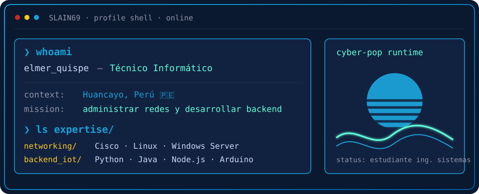
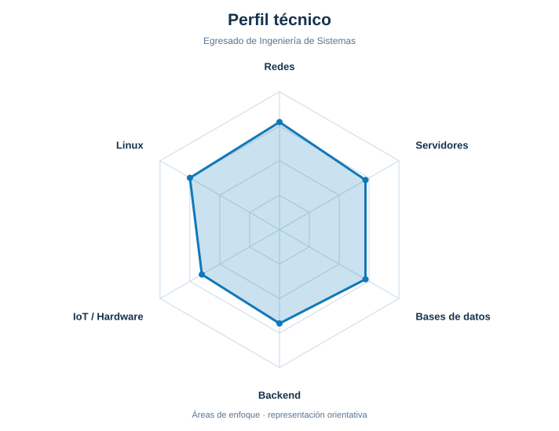
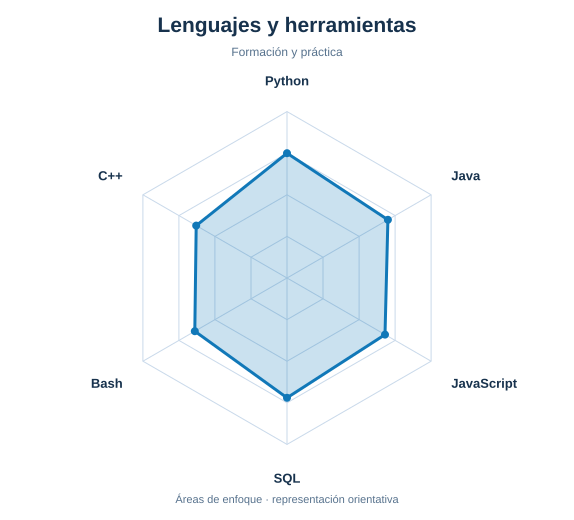

<!-- LOCAL CITY-POP BANNER -->
<a href="https://github.com/SLAIN69">
  <picture>
    <source media="(prefers-color-scheme: dark)" srcset="assets/banner-dark.v9.svg">
    <source media="(prefers-color-scheme: light)" srcset="assets/banner-light.v9.svg">
    
  </picture>
</a>

 

---

## `$ whoami`

  

 

## `$ cat tech-stack.yaml`

<table border="1" cellpadding="14" bgcolor="#0A192F">
  <thead>
    <tr>
      <th colspan="2" align="left"><code>SLAIN69:~$ cat tech-stack.yaml</code></th>
    </tr>
  </thead>
  <tbody>
    <tr>
      <td width="50%" valign="top"><code>├─ 🌐 networking_servers:</code>  
        
         
        <code>Cisco · Linux · Windows Server</code>
      </td>
      <td width="50%" valign="top"><code>├─ 🗄️ databases:</code>  
        
        
         
        <code>SQL Server · MySQL · MariaDB</code>
      </td>
    </tr>
    <tr>
      <td valign="top"><code>├─ 💻 backend_frontend:</code>  
         
        <code>Node.js · Express · React</code>
      </td>
      <td valign="top"><code>├─ 🔌 hardware_iot:</code>  
         
        <code>Arduino · C++ · Hardware</code>
      </td>
    </tr>
    <tr>
      <td valign="top"><code>├─ ✦ languages_scripting:</code>  
         
        <code>Python · Java · Bash</code>
      </td>
      <td valign="top"><code>╰─ ⌁ tools_virtualization:</code>  
        
         
        <code>Git · GitHub · VMware · VirtualBox</code>
      </td>
    </tr>
  </tbody>
  <tfoot>
    <tr>
      <td colspan="2"><code>status: ready&nbsp;&nbsp;·&nbsp;&nbsp;location: Huancayo, Perú</code></td>
    </tr>
  </tfoot>
</table>

---

## `$ kubectl get signals --all-namespaces`

  <picture>
    <source media="(prefers-color-scheme: dark)" srcset="assets/radar-dark.svg">
    <source media="(prefers-color-scheme: light)" srcset="assets/radar-light.svg">
    
  </picture>&nbsp;
  <picture>
    <source media="(prefers-color-scheme: dark)" srcset="assets/radar-langs-dark.svg">
    <source media="(prefers-color-scheme: light)" srcset="assets/radar-langs-light.svg">
    
  </picture>

<code>signals: networking_backend_radar · language_stack_radar · status: healthy</code>

---

<!-- SOCIALS -->
## `$ connect --socials`

 
 

Hecho con ☕ y mucha dedicación desde Huancayo, Perú · @SLAIN69

